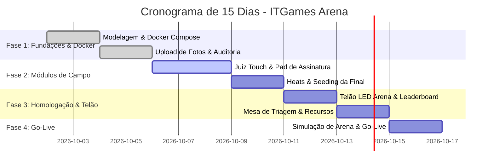

# Plano Estratégico de Implantação • ITGames Arena (15 Dias) 🗓️

Cronograma executivo para implantação, auditoria, triagem de súmulas com foto e homologação de produção da plataforma **ITGames Arena** (CrossFit & HYROX).

---

## 🎯 Metas Principais
1. **Súmulas com Foto & Assinatura Digital**: Juízes fotografam a prancheta de papel e coletam assinatura touch do atleta.
2. **Auditabilidade & Triabilidade**: Trilha de logs imutável para toda alteração de notas com histórico de justificativas.
3. **Live Leaderboard & Telão LED**: Pontuação calculada em tempo real com regras oficiais de CrossFit (100, 95, 90...) e HYROX (tempo líquido).
4. **Resiliência Offline-First**: O app do juiz e a mesa de auditoria funcionam mesmo com oscilações de 4G/Wi-Fi na arena.

---

## 📅 Cronograma Diário (Sprint 1 a 15)

### 🗓️ Semana 1: Backend, Docker, Súmulas com Foto & Auditoria
- **Dia 1-2 (Fundações & Docker):**
  - Configuração do novo backend NestJS em [`itgames-api`](file:///d:/Projects/fitness/itgames/itgames-api) com `docker-compose.yml` (PostgreSQL 15 + API).
  - Configuração de rede aberta (`0.0.0.0:3333` e `0.0.0.0:3000`) para acesso local e via VPN.
- **Dia 3-4 (Fotos de Súmulas & Trilha Imutável):**
  - Módulo de upload e armazenamento de fotos de súmulas físicas de campo.
  - Gravação automática de registros de auditoria em [`AuditLog`](file:///d:/Projects/fitness/itgames/itgames-api/prisma/schema.prisma) para qualquer criação ou retificação de nota.
- **Dia 5-7 (App do Juiz & Modo Arena):**
  - Testes do cronômetro touch, contador de repetições e botão No-Rep em tablets e smartphones.
  - Captura da assinatura digital do competidor na tela touch.

---

### 🗓️ Semana 2: Baterias, Leaderboard de Telão & Mesa de Triagem
- **Dia 8-9 (Heats, Lanes & Seeding Especial):**
  - Validação do gerador automático de baterias por quantidade de raias.
  - Teste do algoritmo de Seeding de Finalistas para alocação nas raias centrais.
- **Dia 10-11 (Live Leaderboard & Telão LED):**
  - Homologação do modo Telão Full-Screen com rotação de categorias a cada 15 segundos para TVs e projetores.
  - Teste de visualização pública para atletas com fotos das súmulas aprovadas.
- **Dia 12-13 (Central de Triagem de Recursos & Contestações):**
  - Split-screen no painel do Head Judge (foto da súmula de um lado vs score digitado do outro).
  - Fluxo de análise de contestação com parecer formal registrado em auditoria.

---

### 🚀 Semana 3: Simulação Geral de Prova & Go-Live
- **Dia 14 (Simulação Real na Arena / Dry Run):**
  - Simulação com 8 raias simultâneas, lançamento de scores por 8 juízes e transmissão no telão ao vivo.
  - Teste de corte de internet (resiliência offline) para validação de sincronização posterior.
- **Dia 15 (Go-Live Oficial & Entrega):**
  - Publicação do sistema em ambiente oficial de competição.
  - Entrega dos manuais de operação para árbitros, Head Judges e organizadores.
